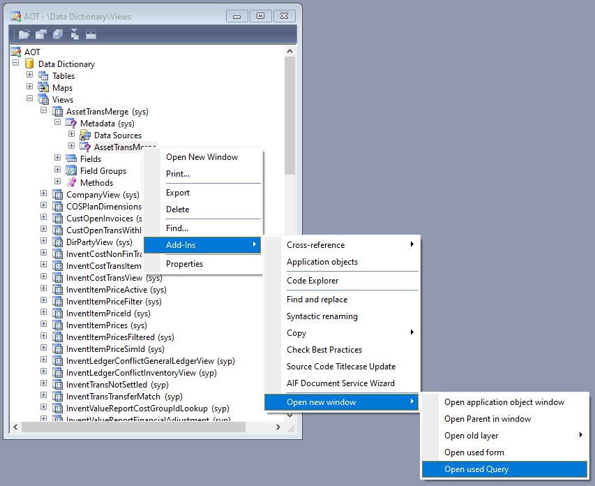
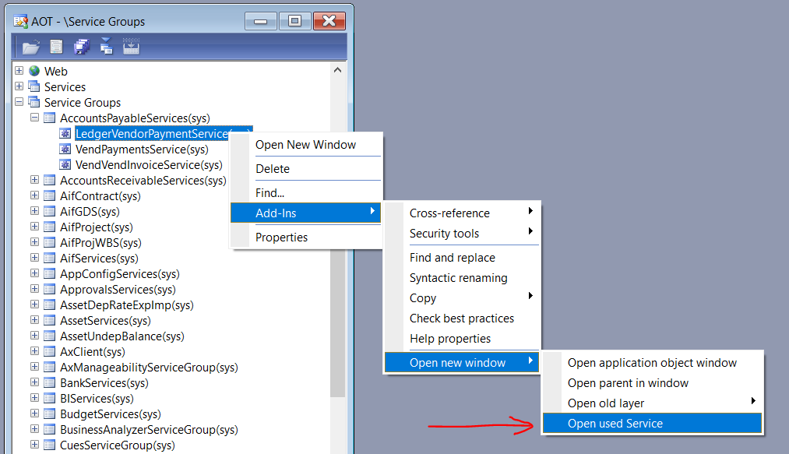

# SysOpenNewWindow

[project]:https://github.com/mazzy-ax/SysOpenNewWindow
[license]:https://github.com/mazzy-ax/SysOpenNewWindow/blob/master/LICENSE

[SysOpenNewWindow][project] &ndash; добавляет пункты в контекстное меню `Add-Ins \ Open new window` в [Microsoft Dynamics AX 2009](ax2009), [Microsoft Dynamics AX 2012](ax2012).

В `ax2009` добавлен пункт меню для объекта `AOT`:

* `View \ Query`: Open used Query

В `ax2012` добавлены пункты меню для объектов `AOT`:

* `View \ Query`: Open used Query
* `Security \ Entry point`: Open used Menu item
* `Service`: Open used Class
* `Service group`: Open used Service

## ChangeLog

* [CHANGELOG.md](CHANGELOG.md)
* <https://github.com/mazzy-ax/SysOpenNewWindow/releases>

## Помощь проекту

Буду признателен за ваши замечания, предложения и советы по проекту как в разделе [Issues](https://github.com/mazzy-ax/SysOpenNewWindow/issues), так и в виде письма на адрес <mazzy@mazzy.ru>

Мазуркин Сергей (mazzy)
